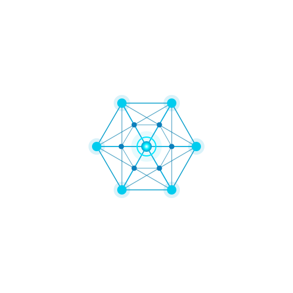

<table border="0" cellpadding="10" cellspacing="0">
  <tr>
    <td width="200">
      
    </td>
    <td>
      <h1 style="margin:0">AxialNet</h1>
      
<strong>Connected At the Core</strong>

    </td>
  </tr>
</table>

---

## What is AxialNet?

AxialNet is building the backbone of modern connected systems — robust, scalable, and engineered from the core outward. We design and ship infrastructure tools, networking utilities, and open-source libraries that help teams move fast without losing control.

---

## What we're working on

- **Core networking primitives** — low-level building blocks for distributed systems
- **Developer tooling** — CLIs and SDKs for seamless integrations
- **Open protocols** — transparent, community-driven standards

---

## Get involved

We build in the open. Contributions, feedback, and ideas are always welcome.

- Browse our [repositories](https://github.com/axialnet)
- Open an [issue](https://github.com/axialnet/axialnet/issues)
- Read our [contributing guide]([CONTRIBUTING.md](https://github.com/axialnet/.github/blob/main/CONTRIBUTING.md))

---

  Built with intention. Scaled with care.

